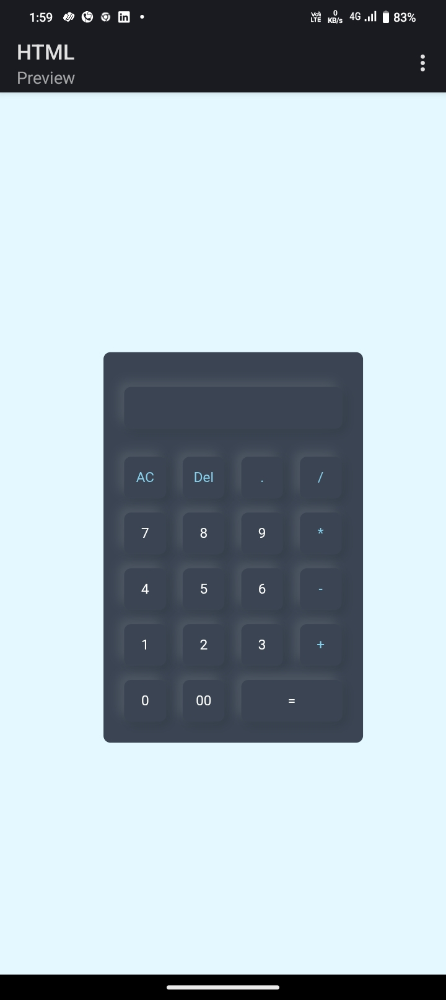

# 🧮 Simple Calculator (HTML & CSS)

<dfn>This project is a simple calculator built using HTML and CSS to create a clean and responsive user interface. The calculator layout includes a display screen and a grid of buttons for digits (0–9), basic arithmetic operators (+, −, ×, ÷), a clear button, a decimal point, and an equals button.</dfn>

 >⚠️ *Note: This is a static user interface only. No JavaScript functionality is implemented.*

## ✨ Features

- Clean calculator layout with:
  - Number buttons (0–9)
  - Operators (+, −, ×, ÷)
  - `=` (Equals),
  -  `AC` (Clear All), and
  -  `DEL` (Delete One) buttons
- Designed using **Flexbox** for layout.
- Fully responsive on small and large devices.
  
---

## 💻 Technologies Used

- **HTML5** – Structure and layout.
- **CSS3** – Styling with Flexbox.
---

## 🎯 Purpose of the Project

This project was created to practice building responsive user interfaces using only HTML and CSS. It focuses on layout design and styling without adding functionality.

---

## 📸 Preview

<h3>Author- Shravani Thouta </h3>
